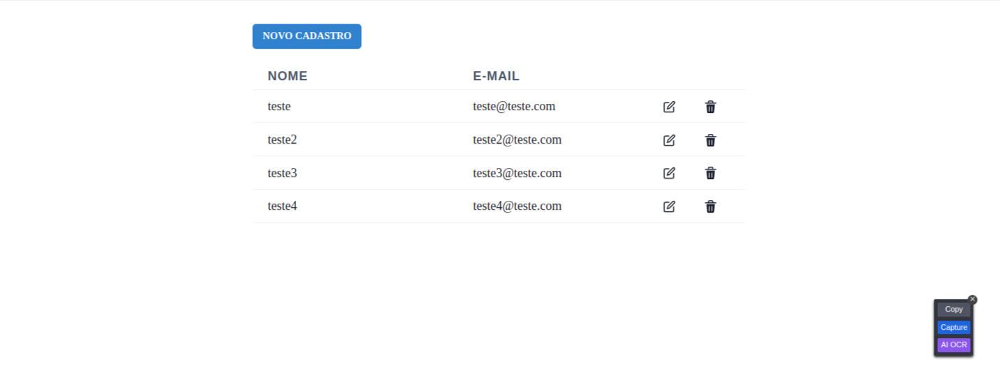

<hr>

# HMZ SOLUTIONS - FRONTEND

Bem-vindo ao HMZ SOLUTIONS FRONTEND! 🚀 Este é um repositório dedicado ao projeto teste HMZ SOLUTIONS FRONTEND, Projeto realizado como exercício ao teste de frontend utilizando a tecnologia React.

    Instruído por Alice HMZ

## Descrição

**HMZ SOLUTIONS FRONTEND** é uma aplicação web que recria a interface do seguinte teste:

>"O teste consiste em o usuário Adm faça o login e Administre seus usuários, precisamos editar ou excluir os usuários dentro do Painel.
No arquivo em anexo você vai receber uma documentação em CRUD, para que você consiga criar seu projeto React e integrar os dados"

Este repositório contém o código-fonte e os arquivos essenciais para executar a aplicação em sua máquina local.

## Funcionalidades Principais

- 🌐 Recriação da Interface CRUD
- 📚 Recursos Interativos
- 💻 Ambiente de Desenvolvimento Integrado (IDE)

## Instruções de Instalação

Siga estas etapas para configurar o HMZ SOLUTIONS FRONTEND em sua máquina:

1. **Clone o Repositório:**

    ```bash
    git clone https://github.com/devbdallagnol/REACT_CRUD
    ```

2. **Acesse a pasta **

    ```bash
    cd REACT_CRUD
    ```

2. **Instale as dependências (npm ou yarn)**

    ```bash
    npm install
    ```

3. **Inicie o projeto**

    ```bash
    npm run dev
    ```

4. Acesse o projeto em http://localhost:5173 no seu navegador.  
<br>
<hr>

### Contribuição

Contribuições são bem-vindas! Se você deseja melhorar o projeto, siga estas diretrizes:

1. Faça um Fork do projeto
2. Crie uma nova branch `git checkout -b feature/nova-feature`
3. Faça commit das suas alterações `git commit -am 'Adiciona nova feature'`
4. Faça push para a branch `git push origin feature/nova-feature`
5. Abra um Pull Request

### Contato

Se precisar de ajuda ou tiver alguma dúvida, sinta-se à vontade para entrar em contato:

Desenvolvedor: @devbdallagnol
